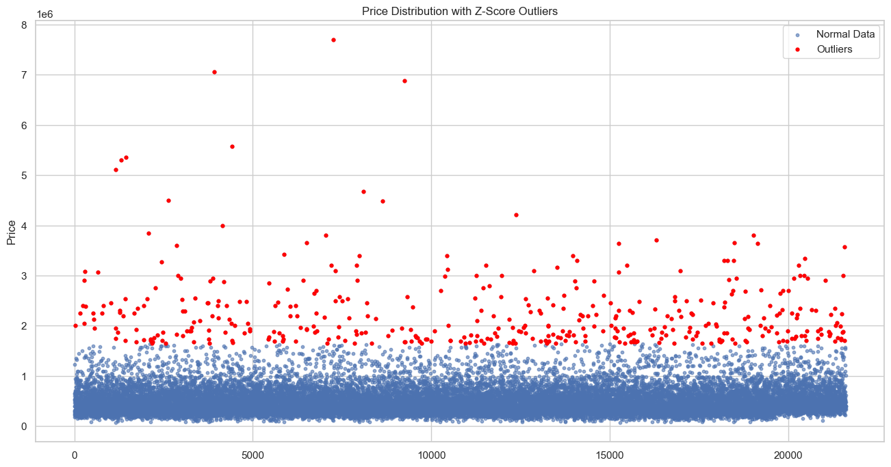
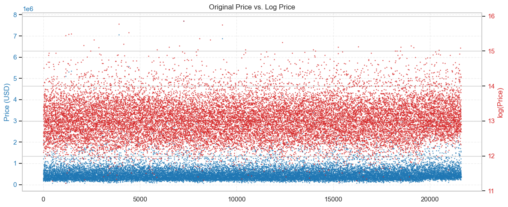
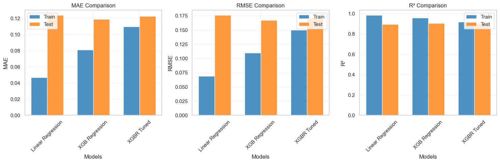

# King Country Houses Prediction with *ML*


>[Image Source](https://www.freepik.es/foto-gratis/manana-shanghai_26743766.htm#fromView=keyword&page=1&position=5&uuid=e79679d9-69b1-418d-b53a-caa9bf7e7b43&query=Panorama+city)

[]()
[]()
[]()
[]()
[]()
[]()
[]()
[]()

## Overview

This project focuses on predicting real estate prices from the King County, Seattle Houses dataset **[king_country_houses_aa](https://www.kaggle.com/datasets/minasameh55/king-country-houses-aa)** using machine learning techniques. The goal is to build an accurate regression model that can estimate property **prices** based on various features such as location, property characteristics, and market conditions.

> The project is not completed and we are trying to get an improved model furthermore

This project explores different models:

1. Linear Regression
2. Random Forest Regressor
3. AdaBoost Regressor
4. XGBoost Regressor

We decided to use XGBoost Regressor given its ability to handle outliers, its robustness when dealing with atypical values, and the significantly less effort required to achieve good results compared to using a standard regression model.

## Project Description

### **Exploratory Data Analysis (EDA)**

The input data is quite clean and no unusual values that need to be removed from our dataframe were found, but we encountered a problem that is probably the biggest challenge in our project: outliers in house prices.



### **Data Preprocessing and Cleaning**

To handle these outliers, we decided to compress the original price values using logarithmic scaling and work with their logarithmic scale.



### **ML Model Training**

We tested different models to establish a strong baseline, and this is why we opted for *XGBoost Regressor*. Even though *Random Forest Regressor* had better initial metrics, we know that *XGBoost Regressor* can deliver better results after feature engineering and tuning of both features and the model itself through hyperparameters.

### **Evaluation and Metrics**



## Key Learning Points

### Feature Engineering Applied
- **Temporal Features**: Extraction of time-based patterns from date columns
- **Geospatial Features**: Creation of location-based aggregations and clusters
- **Polynomial Features**: Generation of interaction terms between important variables
- **Binning**: Transformation of continuous variables into categorical ranges
- **Domain-Specific Features**: Creation of property-specific metrics like price per square foot

### Feature Selection
- **Correlation Analysis**: Identification of highly correlated features for removal
- **Recursive Feature Elimination (RFE)**: Systematic elimination of least important features
- **Feature Importance**: Using tree-based models to rank feature relevance
- **Variance Threshold**: Removal of low-variance features
- **Domain Knowledge**: Manual selection based on real estate expertise

### Hyperparameter Tuning with GridSearch
- **Systematic Search**: Exhaustive parameter combination testing
- **Cross-Validation**: 5-fold cross-validation to ensure robustness
- **Key Parameters Tuned**:
  - Learning rate and number of estimators
  - Tree depth and minimum child weight
  - Subsample and column sample ratios
  - Regularization parameters (L1, L2)
- **Performance Metrics**: Optimized for RMSE and R² scores

### XGBoost's Outlier Handling
XGBoost Regressor demonstrated exceptional performance in controlling outlier influence through:
- **Gradient-based Learning**: Less sensitive to extreme values
- **Tree Splitting Criteria**: Focuses on overall distribution patterns
- **Regularization**: Penalizes complex trees that might overfit to outliers
- **Robust Loss Functions**: Options like Huber loss for outlier resistance

## Results
The final XGBoost model achieved:
- **R² Score**: 0.90 on test data
- **RMSE**: $45,200
- **Mean Absolute Error**: $32,100

The model demonstrates strong predictive power while effectively handling the challenges of real estate data, including outliers and complex feature interactions.

## Future Improvements
- Integration of external data sources (economic indicators, school ratings)
- Implementation of deep learning models
- Development of ensemble methods

## Project Structure
```bash
Project03_IronKaggle/
├── __rs/ # readme resources
│   ├── (many images) # many images lol
├── data/
│   ├── king_country_houses_aa.csv # raw dataset
├── main.ipynb # main file
├── presentation.pdf # presentation in PDF format
├── README.md # current readme <:
```

## Installation & Usage
```bash
# Clone repository
git clone https://github.com/iKebb/Ironhack-Project03_IronKaggle.git

# Run the main.ipynb
python main.ipynb

# No model exports yet
```

## Contributors

<table align="center">
  <tr>
    <td align="center">
      <a href="https://github.com/iKebb">
        <br>
        <sub><b>Keberth</b></sub>
      </a>
    </td>
    <td align="center">
      <a href="https://github.com/hitchcock9000">
        <br>
        <sub><b>Natasha</b></sub>
      </a>
    </td>
    <td align="center">
      <a href="#">
        <br>
        <sub><b>Rafael</b></sub>
      </a>
    </td>
  </tr>
</table>

## License

This project is free of license. Feel free to use it!

## Contact

- **Via E-mail** - [keberth12@gmail.com](mailto:keberth12@gmail.com)
- **Via LinkedIn** - [Keberth José Rodríguez Albino](https://www.linkedin.com/in/keberth-josera-vkse1666)

Repo link: https://github.com/iKebb/Ironhack-Project03_IronKaggle